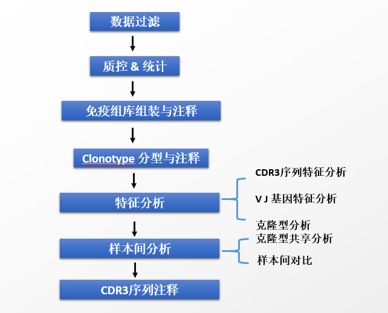

# 10x单细胞免疫组分析结题报告

## 项目整体流程概况

### 项目信息

&[项目信息](./table/project.txt)

### 分析项目及基本要求

&[分析项目](./table/content.txt)

### 实验建库流程

#### 概述

通过对不同的样本组织在合适的条件下进行解离之后，使用[10X VDJ解决方案]([Single Cell Immune Profiling -Official 10x Genomics Support](https://support.10xgenomics.com/single-cell-vdj))进行建库。

 

#### 细胞悬浮液上机

将制备好的细胞悬浮液利用微流控芯片，凝胶磁珠和油滴分别加入到Chromium Chip A的不同泳道中，经由微流体“双十字”交叉系统形成GEM。细胞悬液浓度应控制在700-1200细胞/ul，不同于Chromium Single Cell 3’ Solution捕获mRNA的3’端进行转录组测序，Chromium Single Cell 5’ Solution既可以捕获mRNA的5’端进行转录组测序，也可以将扩增好的cDNA序列一分为三（同时测TCR与BCR），同时进行免疫组库的测序。

#### 文库构建

##### VDJ 文库构建

1）取其中一份cDNA, 使用含有5'接头的通用引物和TCR/BCR恒定区的连续巢式引物进行巢式PCR扩增，此过程加上测序接头P5，实现TCR区域富集；

2）接下来使用酶切进行片段化和选择合适长度的片段，获得跨越TCR转录本的V(D)J片段；

3）通过末端修复、加A、接头连接Read2测序引物，PCR构建含有P5和P7接头的V(D)J文库。

##### 5‘ mRNA文库构建

取其中一份cDNA进行酶切片段化并筛选合适片段，通过末端修复、加A、接头连接Read2测序引物，PCR扩增构建含有P5和P7接头的5’表达谱文库。

 

#### 上机进行高通量测序

利用Illumina测序平台NovaSeq对构建好的文库进行Pair-end双端文库测序。

### 分析流程

测序得到的原始数据我们称之为raw reads，之后我们会根据10x scRNA-Seq独特的文库结构，对reads的Barcode，UMI，插入片段部分进行拆分，之后比对至物种特异的VDJ库，使用CellRanger VDJ 进行数据的过滤、组装、比对、与注释等分析。具体分析流程见下图。

## 项目分析结果

### Cell Ranger 分析结果

#### 文库基本情况

测序得到的reads根据序列组成可以分为：用于识别细胞与定量的 R1(Barcode+UMI) 序列，用于拼接V(D)J区域的R2序列。由于插入片段的长度不同，丰富的R2起始位点可以完全覆盖每个mRNA的目标区域。使用10x Genomics官方分析软件Cell Ranger 对下机数据进行识别，过滤与组装等工作。详细结果见[Cellranger 网页报告](./table/web_summary.html)。

在对序列进行组装之前，Cell Ranger会完成对reads的去接头等质控操作，接下来会进行细胞的鉴定以及常规指标的统计。

&[表 1 测序数据统计](./table/table1.txt)

**注：** 

- Category：		指标				
- Number of Read Pairs：	总reads数		

- Valid Barcodes ：	有效barcode数（每个barcode代表一个细胞）

- Q30 Bases in Barcode：	Barcode中的Q30碱基占比

- Q30 Bases in RNA Read：	RNA reads中的Q30碱基占比

- Q30 Bases in RNA UMI：	RNA UMI 中的Q30碱基占比	

**结果目录：02_Cellranger**

#### 数据的过滤、组装、比对、与注释

**Contig过滤、组装**

将过滤获得的高质量测序数据，使用Cell Ranger将R2端序列比对到参考V(D)J fragments 序列，根据过滤规则，至少有15bp比对到该参考序列区域的reads进行保留，然后对每个细胞进行Contig的拼接及注释筛选。筛选保留的单个细胞Contig会用于后续样本一致序列的拼接。

Cell Ranger使用了De Bruijn graph算法（kmer长度为20）来对每个细胞的V(D)J区域进行组装,并且对每个细胞内的UMIs进行一系列的筛选，基于过滤后的UMIs来进行区域的contig拼接。 

对于contig拼接过程中，Cell Ranger亦定义了多条质控措施：

1）对contig进行V区的5’UTR区域修剪，富集的引物也将被修剪。

2）将仅含有C annotation的contig去除，因为这些contig会带来噪声。

3）如果某条contig相对于参考序列仅有单碱基的变异，并且仅被一条UMIs支持，则Cell Ranger会纠正这个突变错误。

4） 低于300bp长度的contig也被去除

具体的过滤与组装方法请参考(Cell Ranger方法)[https://support.10xgenomics.com/single-cell-vdj/software/pipelines/latest/algorithms/assembly]。

**Contig比对、注释**

V(D)J 的contig注释的目标是将contig上的V、D、J 片段都进行确定，并且明确CDR3序列. 同时通过上述信息判断该contig是否为productive，即该contig是否可以组成有功能的TCR或BCR.

1）将每个细胞组装出的contig序列比对至参考序列。

2）首先匹配出V区的初始部分，接下来匹配J区的终端部分、接下来再确定最优比对至D区的contig，同时，需要注意的是V端开始与J端结束两者之间不允许有终止子。

3）确定CDR3区域：如果contig横跨包含起始密码子的 L+V 区的5’端，则从对齐的V区域的c端Cys残基开始，寻找CDR3 motif(Cys-XGXG/FXXG)，否则在整个框架中寻找CDR3序列，CDR3的长度被限制为26-80个核苷酸；

具体结果见：

&[表 2 contig 比对结果](./table/table2.txt)

**注：** 

- Category：指标
- Estimated Number of Cells：有效细胞数

- Mean Read Pairs per Cell：样本中每个细胞的平均read pairs 数

- Number of Cells With Productive V-J Spanning Pair：Contig被注释为有效的VJ区段的数目

- Reads Mapped to Any V(D)J Gene: 比对至V(D)J 基因的reads比例

- Reads Mapped to TRA：比对至TRA链的reads比例

- Reads Mapped to TRA：比对至TRB链的reads比例

- Mean Used Read Pairs per Cell：所有细胞用于contigs组装的平均数

- Fraction Reads in Cells：可用reads占总reads的比例

- Median TRA  per Cell：单个细胞比对到TRA contig的UMI数量的中位值

- Median  TRB UMIs per Cell：单个细胞比对到TRB contig的UMI数量的中位值

- Cells With Productive V-J Spanning Pair：跨越VJ区域被注释为有效细胞数的的比例.

- Paired Clonotype Diversity：克隆型的多样性

- Cells With TRA /TRB Contig: 含有TRA/TRBcontig的细胞比例

- Cells With CDR3-annotated TRA/TRB Contig：含有TRA/TRBcontig且能检测出CDR3序列的细胞比例

- Cells With V-J Spanning TRA/TRB Contig :含有TRA/TRB contig且可以跨越VJ区的细胞比例

- Cells With Productive TRA/TRB Contig： 含有TRA/TRB contig且该contig被确定为Productive的细胞比例

**结果目录：02_Cellranger**

#### 一致性序列判断

在完成contig的组装与注释之后，Cell Ranger 会进行 Consensus拼接：所有属于相同克隆型的细胞的contig组装在一起得到一致序列。如果细胞具有相同的、精确比对的CDR3核苷酸序列，则它们分组分为同一克隆型。含有该克隆型的个数（Barcode个数）即为该Clonotype的丰度。

**Contig 注释结果**

&[表 3 contig 注释结果](./table/table3.txt)

**注：** 

- barcode：细胞ID号
- is_cell：该barcode是否为细胞

- contig_id：拼接出的contig ID号

- length：该contig的长度

- chain: 该Contig的链信息

- 第7~10列：V D J C 区的基因注释结果

- full_length：该contig是否跨越V（D）J区

- productive:该Contig是否为有效

- cdr3：CDR3 区氨基酸序列

- cdr3_nt: CDR3区核酸序列

- reads:比对到该细胞的reads数

- umis：比对到该细胞的umi数

- raw_clonotype_id:原始克隆型的id号

- raw_consensus_id：一致性序列的ID号

**结果目录：02_Cellranger**

**Consensus拼接结果**

&[表 4  Consensus拼接结果](./table/table4.txt)

**注：** 

- clonotype_id：clonotype_id：clonotype的ID号
- consensus_id:consensus的ID号

- length:该consensus的长度

- chain: 该Contig的链信息

- 第5~8列：V D J C 区的基因注释结果

- full_length：该consensus是否跨越V（D）J区

- productive:该consensus是否为有效

- cdr3：CDR3 区氨基酸序列

- cdr3_nt: CDR3区核酸序列

- reads:比对到该细胞的reads数

- umis：比对到该细胞的umi数

- raw_clonotype_id:原始克隆型的id号

- raw_consensus_id：一致性序列的ID号

**结果目录：02_Cellranger**

**Consensus clonotype的详细信息**

&[表 5  Consensus clonotype 统计结果](./table/table5.txt)

**注：** 

- clonotype_id 该Consensus clonotype 的ID号
- frequency：该Consensus clonotype所占的细胞频数

- proportion:该Consensus clonotype所占的细胞频率

- cdr3s_aa:该Consensus clonotype的氨基酸序列

- cdr3s_nt：该Consensus clonotype的核酸序列

**结果目录：02_Cellranger**

### 高级分析结果

#### 稀释曲线

免疫组库的克隆型的多样性与样本的免疫适应性密切相关，通过绘制稀释曲线（rarefaction curve）可以明确克隆型的丰富程度与克隆型是否饱和。

#### Clonality

评估样品多样性的方法之一是参考其克隆性。我们提供了几种评估克隆性的方法。包括克隆数、最高扩增的克隆型占比、最小扩增的克隆型占比等。

**克隆型频数**

**注：** 横坐标表示样本，纵坐标表示克隆频数

**不同扩增频数的克隆型占比**

**注：** 横坐标表示样本，纵坐标表示克隆占比。柱状图颜色指不同扩增水平的克隆所占总体的比例，例如[1:10)指的是克隆扩增数最多的1-10种克隆型。

**注：** 横坐标表示样本，纵坐标表示克隆占比。柱状图颜色指不同扩增频数的克隆型所占总体的比例，例如"1"指的是克隆扩增数为1的克隆型占总体的比例。

**结果目录：03_analysis/Clonality/**

#### Geneusage

淋巴细胞发育中免疫球蛋白可变区基因片段经重组而形成完整可变区序列的过程。重链可变区基因由V、D、J各1个基因片段组成，轻链可变区基因由V、J各1个基因片段组成，VDJ基因均有多个拷贝，各片段通过随机组合(即重排)而形成多样性的抗体可变区。我们可以根据不同基因的使用频数以及基因配对关系推导其中的规律。

**注：** 横坐标表示V J 基因， 纵坐标表示基因所占的频率。

通过比较不同样本之间的特定V J基因的使用差异，进一步确定样本之间的关联性，在这里我们通过JS散度(*Jensen*–*Shannon* *divergence*)与correlation（相关系数）来进行衡量。

在多个研究中均发现了不同样本之间配对的VJ基因使用频率可能存在差异的情况，基于此我们对样本进行了VJ基因配对的计算与统计，我们使用圈图与热图进行了VJ配对的展示：

**结果目录：03_analysis/Geneusage/**

#### Diversity:多样性评估

我们会使用多种指标来对每个样本的整体的克隆水平进行量化，包括以下几种方式：

Chao1： Chao1估计 是物种丰富度指数

Hill：Hill 指数，物种的有效数

**注：** 每种指数的单独画图可在结果目录中找到

**结果目录：03_analysis/Diversity/**

#### CDR3特征

CDR3是由V和J或者D和J连接的一段区域构成，具有高可变性。CDR3是决定T细胞克隆类型的区域，且直接识别抗原呈递细胞呈递的抗原氨基酸片段。自然状态下，CDR3的长度分布呈正态分布。

**注：** 横坐标为CDR3的长度，单位为base pair，纵坐标轴为克隆数。

**注：** 横坐标轴代表具有不同克隆数的CDR3序列，纵坐标代表克隆数。

**注：** 上图右图表示构成不同CDR3序列的基因的占比。横坐标为CDR3的长度，单位为base pair，纵坐标轴为克隆数，不同的颜色代表不同的V基因。

**结果目录：03_analysis/CDR3_feature/**

#### CDR3 Kmer

通过将CDR3序列按照一定的长度（本报告中选取K=3）进行打断，我们可以获得CDR3的kmer统计结果，当前对于CDR3的kmer研究并不丰富，之前有报道可以根据kmer的降维结果对不同的肿瘤时期进行分型。

**注：** 横坐标表示不同类型的3碱基kmer，纵坐标表示统计个数

**结果目录：03_analysis/Kmer/**

#### Clonotypes_Tracking

由于细胞之间的趋化等作用，免疫细胞可能会被招募产生作用，所以不同的取样部位可能共享某些相同克隆型的细胞，这也暗示着细胞之间的互作网络。我们通过桑基图来直观的展示这一结果。

**结果目录：03_analysis/Clonotypes_Tracking/**

#### CDR3序列注释

迄今位置，已经有许多与CDR3序列结合的抗原肽段被明确，我们使用[VDJDB](https://github.com/antigenomics/vdjdb-db)作为背景对样本的CDR3区段进行注释，以帮助研究人员明晰在样本间具有差异的CDR3序列是否可以进一步判定为候选CDR3序列。

&[表 6 测序数据统计](./table/table6.txt)

**注：**

- gene:所属链
- cdr3：CDR3序列

- species：背景注释所属物种

- antigen.epitope：抗原序列

- antigen.gene：抗原所属基因

- antigen.species：抗原所属物种

- complex.id：xxx

- v.segm：V基因

- j.segm：J基因

- mhc.a：对于的MHC分型

- reference.id：参考来源

## 软件及参考文献信息
### 软件信息
&[软件列表](./static/icon/software.txt)
### 参考文献
[1] CellRanger：[http://support.10xgenomics.com/single-cell/software/overview/welcome](http://support.10xgenomics.com/single-cell/software/overview/welcome).

[2] Dobin A, Davis C A, Schlesinger F, et al. STAR: ultrafast universal RNA-seq aligner[J]. Bioinformatics, 2013, 29(1): 15-21.

[3] Shugay M, Chudakov DM, et al. VDJtools: Unifying Post-analysis of T Cell Receptor Repertoires. PLoS Comput Biol. 2015 Nov 25;11(11):e1004503. doi: 10.1371/journal.pcbi.1004503. PMID: 26606115; PMCID: PMC4659587.

[4] ImmunoMind / immunarch · GitLab：https://gitlab.com/immunomind/immunarch
